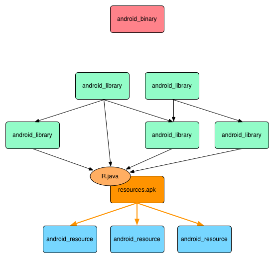
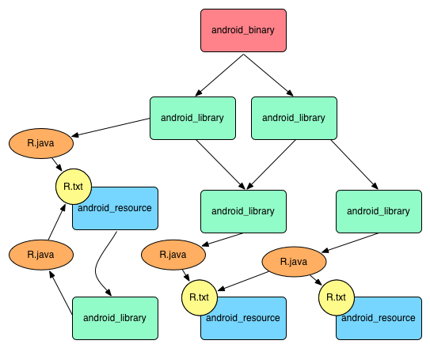
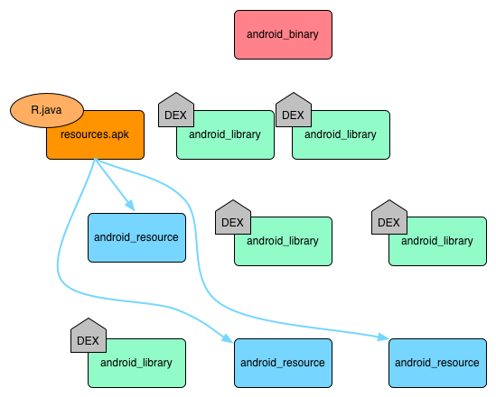
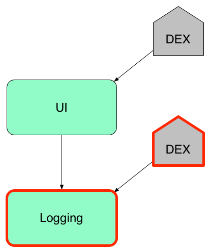
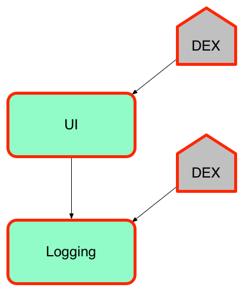
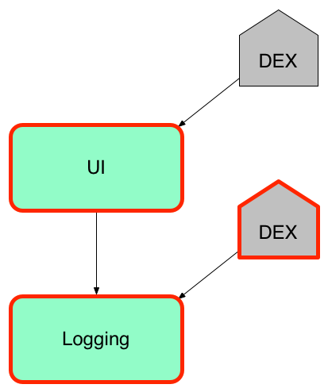
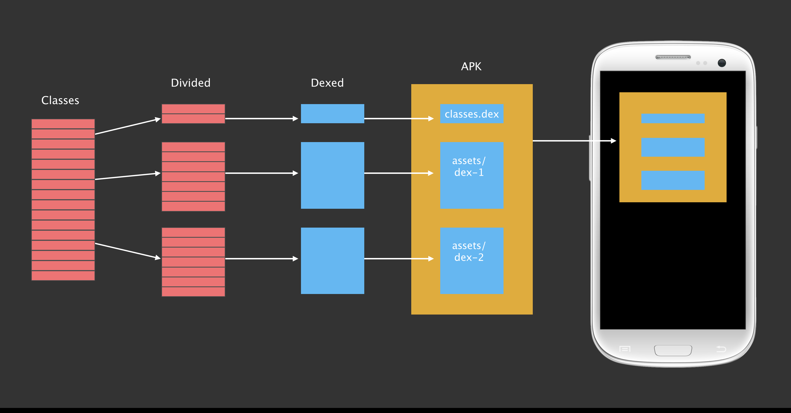
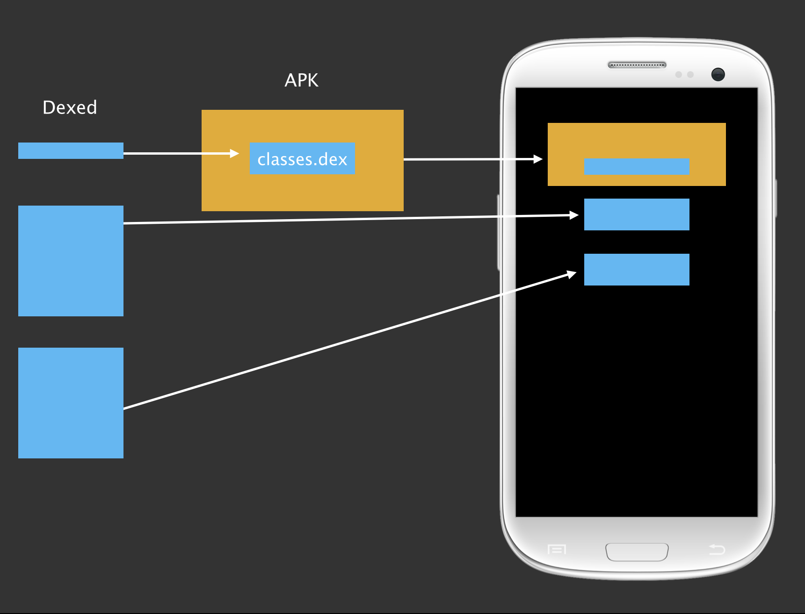
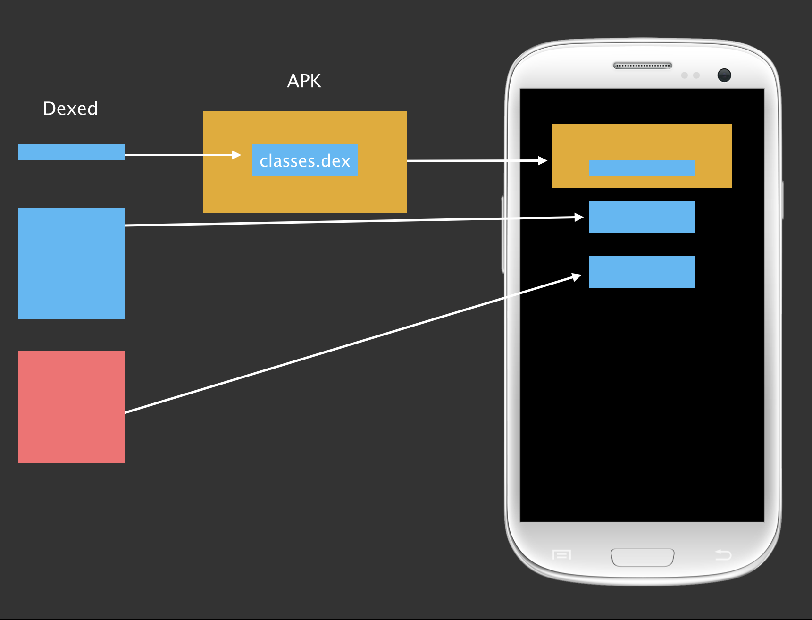
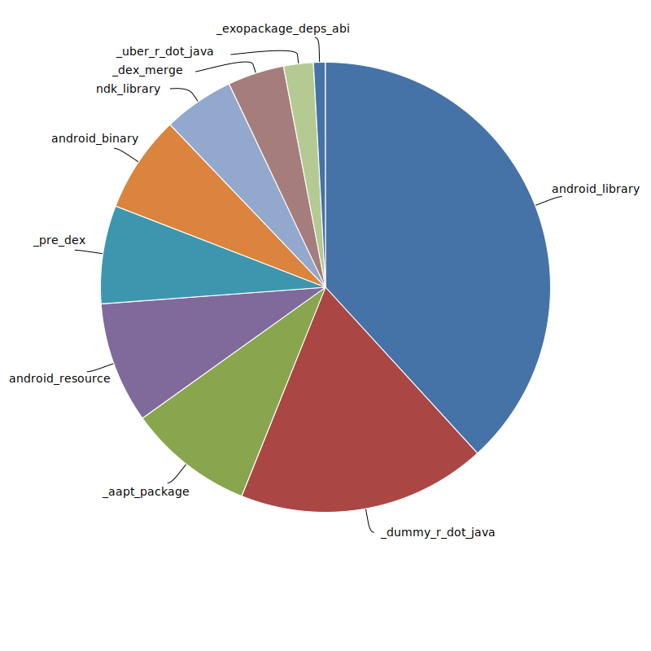

class: center, middle
name: title

# Building Android at Ludicrous Speed


<div style="color: rgb(64, 80, 151); font-size: 18px">(Press 'p' to toggle the presenter notes.)</div>

<table class="author-table">
  <tr>
    <td style="text-align: left">
      Michael Bolin
      <br>
      <span class="email">mbolin@fb.com</span>
    </td>
    <td style="text-align: right">
      David Reiss
      <br>
      <span class="email">dreiss@fb.com</span>
    </td>
  </tr>
</table>

???

As we all know, developing software is an iterative process.
You write code, you run it to see what it does,
and then you try again.
If you have done any frontend web development, you have probably
had the luxury of sub-second edit/refresh cycles that
let you make progress on your webapp very quickly.
Unfortunately, as Android developers, we aren't quite as lucky. Even a small
change to a small app can take 20 seconds to build and run
using the standard Android build tools.

Fortunately, there is an alternative. My name is Michael,
this is my colleague David, and we're here from Facebook
to to show you how build Android apps at ludicrous speed
using our open source build tool, Buck.

And I do mean "show you," so let's start out with a demo.

---

name: demo

# DEMO: Show me Ludicrous Speed!

.center[]

???


What you're about to see is an incremental build of Facebook Messenger.
Messenger is over 250,000 lines of Java code, so it's a pretty big app.
Let's watch as we change the text of a Toast message and rebuild
Messenger to test it out in the emulator.

---

class: center, middle

<div>
<iframe src="//www.youtube.com/embed/rNiZOYYmFcI"
width="700"
height="525"
src="{$url}"
frameborder="0"
allowfullscreen>
</div>

???

Did you see that? It took 7 seconds to rebuild, reinstall, and
restart Messenger! I don't know what sort of incremental build times you
are seeing for your 250,000 line apps, but I'm pretty sure they are nowhere
close to 7 seconds (unless you're using Buck, of course).

OK, let's dive in to how building in Android works under the covers.

---

class: top, center

# Typical dependency graph

.center[]

???

Traditionally, an Android app is organized as a graph of dependencies
like the one shown in the diagram:

* The blue boxes represent Android resources, like the contents of a `res/` directory.
* The green boxes represent Java code.
* The red box represents the final packaged app itself.

---

class: top

# Typical build: Done in stages

.center[]

???

OK, so how does building work in systems like Ant or Gradle?
Well, it is done in stages, so let's rearrange the nodes in our
graph to make things easier to follow.

---

class: top

# Typical build: Create `R.java`

.center[]

???

The first thing that happens is we find all of the resource directories
in the application and use `aapt` to glob them together to create two
files: a `resources.apk`, which is a binary file that contains all of the
resources, and an `R.java` file that serves as an index into the `apk`.

---

class: top

# Typical build: Compile some Java

.center[]

???

Once we have an `R.java` file, we can start compiling the Java code that
depends on resources.

---

class: top

# Typical build: Compile more Java

.center[]

???

And then we can start building the next set of Java code.

---

class: top

# Typical build: Create `classes.dex`

.center[]

???

Once all of the Java code is compiled, we use `dx` to convert all of the
Oracle bytecode to Dalvik bytecode and store it in a large `classes.dex` file.

---

class: top

# Typical build: Create APK

.center[]

???

Now that we have the `classes.dex` and `resources.apk`, we can package
everything together into the final APK, which requires signing and zipping
those artifacts.

Here are some important things to note about this dependency graph:

* Compiling any Java code is gated by the generation of `R.java`.
  This is particularly bad because generating `R.java` is slow.
* If any `android_resource` changes, we have to rebuild everything.
* Regenerating `classes.dex` is proportional to the size of the app
  rather than the size of the Java code that changed.

---

name: about-buck

# About Buck

* Android build tool

???

Now enter Buck, our Android build tool.
--
name: about-buck-2

* Provides fast incremental builds

???

As you saw in the demo, it is really, really fast.

--
name: about-buck-3

* Encourages small, reusable modules

???

It also encourages the use of small, reusable modules.
At Facebook, basically every Java package is in its own module,
and all of this code lives in one folder named `java/` where
the directory names follow the package names, as you would
expect in any Java project. We don't have multiple source
folders of Java code, which makes it easier to find things in a
large repo.

It also makes it easier to share code across
Facebook, Messenger, and Instagram, whose code all lives together
in that `java/` folder that I mentioned.

This use of small modules helps improve code hygiene as well as build times,
as we will see.

---

#  Build Rule

* Built-in procedure to produce an artifact

???

The primary concept to get familiar with in Buck is a *build rule*,
which is a procedure that produces an artifact.

--
* Examples:
  * `android_resource` produces `R.txt`
  * `android_library` produces `.jar`
  * `android_binary` produces `.apk`

???

Buck has build rules for producing `R.txt`, `.jar`, and `.apk` files,
among others. We will focus on these three for this talk.

--
* Groups related files together: defines a module

???

The input files for a build rule along with its output file
define a reusable module in the build system.

--
* Rules can declare other rules as dependencies

???

If a rule needs the output of another rule as an input,
then the producing rule becomes a dependency of the consuming rule.

--
* Forms a graph
  * Build rules are nodes
  * Dependencies are edges
  * **Cycles allowed!** (*under certain conditions)

???

Dividing the traditional Android Library project into
`android_resource` and `android_library` rules was a key insight.
This eliminates a lot of boilerplate.

Most `android_resource` rules do not depend on Java code,
so they either have no dependencies, or dependencies that
are only other `android_resource` rules. The only item
of interest in the `AndroidManifest.xml` is the `package`.
In BUCK, the `package` can be specified as an argument to
`android_resource` instead of requiring the creation of a
boilerplate `AndroidManifest.xml` file.

Many `android_library` rules are just code that are business
logic with no dependency on [UI] resources. There is no reason
to require an `android_library` to have a `res` or `assets` directory.
An `AndroidManifest.xml` is only necessary to declare the
following requirements (or outputs) of the library:

* `<activity>`
* `<broadcast-receiver>`
* `<content-provider>`
* `<permission>`

---

class: top, center

# Back to our dependency graph


???

Now let's explore how we would describe our original dependency graph
in terms of Buck build rules.

---

# Build `android_resource`

```python
android_resource(
  name = 'newsfeed-res',
  package = 'com.facebook',
  res = 'my-res-dir',
  deps = [
    '//res/com/facebook/comments:res',
    '//res/com/facebook/story:res',
  ],
)
```

???

First, we have an `android_resource` rule.

Like all build rules in Buck, it has a name that is used to identify it.

In this case, we explicitly define the `package` for the `R` class that should
be generated as a result of this rule.

We also specify the path to the resources directory. Normally, this is just `res`,
but in this case we specify the nonstandard `my-res-dir` just to demonstrate that
we are not restricted to the default package layout for an Android library project.

Finally, we declare some dependencies, or `deps`, of our `android_resource` rule.
This is necessary when resources in the current `res` directory have references
to resources from other `android_resource` rules.

It may also list an `android_library` in its `deps` if the `android_library`
defines a Java class that is referenced in one of the layouts in the `res` directory.
Although the `android_library` need not be built in order for the `android_resource`
to produce its `R.txt` file, the `.jar` from the `android_library` must be included
in any `.apk` that includes the resources from the `android_resource` rule.

---

class: top, center

# `R.txt` for each `android_resource()`


???

The output for each `android_resource` rule will be an `R.txt` file that
lists the resources found in its `res` directory.

---

name: r-txt

# What does an `R.txt` file look like?

```markdown
int anim fade_in_seq 0x7f04000b
int attr actionBarSize 0x7f0100af
int color fbui_bg_dark 0x7f060071
int dimen title_bar_height 0x7f07000f
int drawable map_placeholder 0x7f0204ca
int id embeddable_map_frame 0x7f0a00e8
int layout splash_screen 0x7f030172
int string add_members_button_text 0x7f0900f8
int[] styleable ThreadTitleView { 0x7f01018a }
```

???

An `R.txt` file looks like this.

Each line corresponds to a field that would be included in an `R.java` file.
The `R.txt` file is more convenient to work with because it is easier to parse.

---

# Build `android_library()`

```python
android_library(
  name = 'newsfeed',
  srcs = glob(['*.java']),
  deps = [
    '//java/com/facebook/data:imagepipeline',
    '//res/com/facebook/newsfeed:newsfeed-res',
  ],
)
```

???

An `android_library` rule is built as follows:

* For each `android_resource` in `deps`:
  * Add its `R.txt` to a set.
  * Add its `package` to a set.
* Merge all of the entries from all of the `R.txt` files into a single `R.txt`.
* Parse the new `R.txt` to generate an `R.java` for each package with non-final fields.
* Compile each `R.java` file and include the resulting `R.class` on the classpath.
* For each `android_library` in `deps`, include its artifact JAR on the classpath.
* Compile the `srcs` against the classpath to generate a JAR.

---

class: top, center

# `R.java` for each set of `R.txt`



???

Let's take a look at how this affects our dependency graph.

One significant difference between Buck and Ant is that if an `.xml` file that
corresponds to an `android_resource` rule changes such that the resulting `R.txt` file is
unaffected (like when changing a hardcoded `dp` value in a layout), neither the
resulting `R.java` file nor the `android_library` that depends on it need to be
rebuilt. This avoids a lot of unnecessary building when tweaking layouts.

Another interesting trick is how this is used to break cyclic
`android_resource`/`android_library` dependencies. Specifically, the
`android_library` is only concerned about the `R.java` file that is produced
from the union of its dependent `android_resource` rules.
The relationship between the `android_resource` and `android_library` is retained
for the purpose of packaging dependencies into an `.apk`, but there is no
longer a circular build dependency.

---

class: top, center

# JAR for each `android_library()`


???

The output `.jar` file for an `android_library` rule contains only the `.class`
files for its `srcs`. It does not contain the `R.class` files for the `R.java`
files it depended on.

---

class: top, center

# DEX for each `android_library()`


???

A `.dex` file is created for each `.jar` file.
We use a fork of the standard `dx` executable that we run in-process.
As `dx` is implemented in Java, we eliminate the start-up overhead of a new JVM
and benefit from JIT optimizations by reusing it. This speeds up `dx` considerably,
which was originally a hotspot in Android build times when we started working on Buck.

---

# Build `android_binary()`

```python
android_binary(
  name = 'fb4a',
  manifest = 'AndroidManifest.xml',
  deps = [
    '//java/com/facebook:newsfeed',
  ],
)
```

???

An `android_binary` rule is used to put everything together and create an
`.apk`. Although an `android_binary` may appear to have few `deps`, it packages
its transitive deps, so the true extent of its dependencies may be larger than it
appears.

---

class: top, center

# Remember our graph


???

Let's see how `android_binary` combines everything together.

---

class: top, center

# Create `resources.apk` and `R.java`


???

First, it creates a `resources.apk` and an `R.java` file as a function of all
of the `android_resource` rules in its transitive deps. (Note that there
could be multiple `R.java` files if not all of the `package` arguments for each
`android_resource` rule is the same.) As is the case in Ant/Gradle, this step
can be very slow.

---

class: top, center

# Recall `.dex` for each `android_library()`



???

In order to perform the next major build step, all of the `.dex` files from
the transitive `android_library` deps must have been generated.

---

class: top, center

# Dex `R.java` and combine to create `classes.dex`


???

Next, the `R.java` file(s) from the previous step are compiled and `dx`'d.
Once that is done and all of the `.dex` files from the transitive
`android_library` deps are available, they are merged into a single `classes.dex`
file.

Once again, we use a fork of `dx` to do this rather than the standard
version of `dx` that comes with the Android SDK. This is significant because
the standard version of `dx` is O(N<sup>2</sup> lg N) in building (where N
is the number of `.dex` files) whereas our fork of `dx` is O(N lg N).
This is a significant performance improvement in creating `classes.dex`.

---

class: top, center

# Create APK


???

Now that `resources.apk` and `classes.dex` have been produced, they can be
combined to create the final `.apk`.

---

class: top, center

# Efficient Parallelization


???

Two notable advantages to the Buck build:

* The expensive `aapt_package` step to generate the main `R.java` file is done
in parallel with the Java compilation.
* The `dx` merge step to generate the `classes.dex` is much more efficient than
dexing all of the JAR files at the end.

---

# Cache avoids rebuilding

We compute a cache key for each build rule:

* Id `//res/com/facebook/story:res`

???

Buck has extremely fast incremental builds because it is smart (and sound)
about how it caches artifacts from previous builds. The output for each
build rule is associated with a cache key. The *cache key* is a SHA-1 has
that is a function of the following information:

* The id of the build rule, which is a combination of its `name` and the
relative path from the project root to the build file that defines the rule.
(This is referred to as a *build target* in Buck. You have seen these used
to identify other build rules via the `deps` argument.)

--
* Type `android_resource`

???

* The type of the build rule: `android_resource`, `android_library`, or
`android_binary`.

--
* Arguments `package = 'com.facebook'`

???

* The values of the arguments passed to the build rule. (These were present in
the definition of the build rule.)

--
* Contents of input files (SHA-1 of `values/strings.xml`)

???

* The contents of any input files for the build rule.
Buck knows which arguments of a build rule correspond to input files
(such as the `srcs` of an `android_library` rule),
so this also comes from the build rule definition. It is important that Buck
relies on file contents rather than last-modified time to ensure that
builds are sound.

--
* Version of Buck

???

* The version of Buck used to do the build. This means that when a new version
of Buck is used for the build, none of the new cache keys will match the old
cache keys.

--
* Cache key of dependent rules (the `deps`)

???

* The cache keys of all of the `deps` also contribute to the rule's own cache
key. This means that any change in its transitive deps will cause a change in
its own cache key.

--

Cache key maps to the zip of files generated by the rule.

???

Because some build rules may generate some additional files not mentioned here,
each cache key maps to a zip of the files produced by the build rule.

This happens for developers doing local builds and on our CI system.

---

# Building a build rule


???

Let's walk through how a build rule is built in Buck.

--

* Cache key is calculated before anything is built

???

Note that the cache key for a build rule can be calculated before anything is
built: it is a function of build rule definitions, file contents, and the
version of Buck.

--

* Buck checks its local directory cache

???

Therefore, Buck starts building a rule by computing its cache key.
Once computed, it checks its local directory cache to see if there is a hit.
If so, it unzips the corresponding zip file over the project directory
and marks the rule as built.

--

* Buck checks the CI build's cache

???

If there is no hit in the local cache, then it tries to do an equivalent fetch
from the remote cache, which is colocated with the continuous integration (CI)
cluster that is used to populate it.
(Builds done in CI are allowed to populate the remote cache whereas local builds
are not.)

--

* Otherwise, it builds locally

???

If Buck fails to get a hit from either cache, it builds the rule locally
and stores the result in its local cache. (Note that the size of the local
cache can be configured so that your disk is not overrun with Buck artifacts.
When a limit is enforced, it behaves as an LRU cache.)

--

.serious-business[Rebuilding a branch is pulled entirely from cache!]

???

One important benefit from this caching system is that doing a build after
switching branches is nearly instantaneous because everything should be pulled
from local cache! That is, assuming you did a build on that branch before
switching away from it, all of the state that Buck cares about should be
restored when you switch back, so all of the cache keys should line up and
everything will be pulled from cache when you build.

--

.serious-business[Clean checkout builds are pulled entirely from cache!]

???

Similarly, if you use a CI system to populate a remote cache and build off of
a revision that has already been built by CI, then a local clean build should be
able to pull all of its artifacts from its remote cache. For large Android apps
that have painfully slow clean builds, this is a tremendous win.

---

# ABI

.center[  ]

???

We have an important optimization for incremental builds
called the "ABI optimization".
When you change a Java library,
Buck can tell whether you've changed the Application Binary Interface,
or just the implementation.
In the latter case, it can avoid some rebuilding.

Imagine a simple case:
a high-level UI library depends on a low-level logging library.
Each rule also has a dex rule that depends on the Java rule.

---

# ABI

```java
public class UI {
  int priority = 5;

  public void onClick() {
    Logger.log(priority, "Clicked.");
  }
}
```

```java
public class Logger {
  void log(int pri, String msg) {
    Disk.write(">" + pri + " " + msg);
  }
}
```

???

Here's what the code might look like.
The UI's click handler is calling the log method.
(I left off `public static` to fit on the slide.)

---

# ABI

```java
public class UI {
  int priority = 5;

  public void onClick() {
    Logger.log(priority, "Clicked.");
  }
}
```

```java
public class Logger {
  void log(int pri, String msg) {
    Disk.write(/* ">" */ ">>>" + pri + " " + msg);
  }
}
```

???

Now imagine you make this change.
The logging prefix changes from ">" to ">>>".
The implementation of the logger has changed, but not the interface.

---

# ABI

.center[  ]

???

Buck will recompile and re-dex the logging library,
but the UI library does not need to be rebuilt at all
because the logging interface has not changed.

---

# ABI

```java
public class UI {
  int priority = 5;

  public void onClick() {
    Logger.log(priority, "Clicked.");
  }
}
```

```java
public class Logger {
  void log(int pri, String msg) {
    Disk.write(">" + pri + " " + msg);
  }
}
```

???

Back to our original code.

---

# ABI

```java
public class UI {
  int priority = 5;

  public void onClick() {
    Logger.log(priority, "Clicked.");
  }
}
```

```java
public class Logger {
  void log(/* int */ Integer pri, String msg) {
    Disk.write(">" + pri + " " + msg);
  }
}
```

???

Let's say you change the priority argument from int to Integer.
Now the interface has changed in an important way.
The UI library needs to auto-box the priority argument.

---

# ABI

.center[  ]

???

In this case,
we obviously still need to recompile and re-dex the logging library.
We also need to recompile and re-dex the UI library
to pick up the auto-boxing code.

---

# ABI

```java
public class UI {
  int priority = 5;

  public void onClick() {
    Logger.log(priority, "Clicked.");
  }
}
```

```java
public class Logger {
  void log(int pri, String msg) {
    Disk.write(">" + pri + " " + msg);
  }
}
```

???

Back to our original code.

---

# ABI

```java
public class UI {
  int priority = 5;

  public void onClick() {
    Logger.log(priority, "Clicked.");
  }
}
```

```java
public class Logger {
  void log(int pri, String msg) {
    Disk.write(">" + pri + " " + msg);
  }
  void log(String msg) {...}  // new
}
```

???

Now we've added a new overload of the log method
that doesn't require a priority.

---

# ABI

.center[  ]

???

Obviously,
we still need to recompile and re-dex the logging library
to pick up the new method.
We also need to recompile the UI library.
Even something as simple as adding a public method
can break the build by creating an ambiguous overload.
However, the compiled output of the UI library does not change,
so we can skip re-dexing the output.

Note that compiling the UI library
and dexing the logging library can happen in parallel.

---

# dx improvements

* Forked `dx`

???

Buck includes a fork of Android's dx tool
that has some (compile-time) performance improvements.

--

  * **Merge is O(N lg N), not O(N ^ 2)**

???

This is a big difference.

Instagram merge went from ~11s to ~2.5s

--

* Verified was safe to run in-process
* Made it safe to run concurrently in-process

???

We run multiple copies of dx concurrently
within the buckd process.

--

* Get a lot of help from the hotspot JIT

???

~2.5x-40x improvement

---

# ApkBuilder and Installation

.left-column[
#### ApkBuilder
* Assembles assets, dex, and native libraries into APK
* &gt;7 seconds for large apps
]

.right-column[
<span class="big-picture">  </span>
]

???

Gradle calls this "packageDebug"

Even slower with ant due to separate signing step

---

# ApkBuilder and Installation

.left-column[
#### ApkBuilder
* Assembles assets, dex, and native libraries into APK
* &gt;7 seconds for large apps

#### Installation
* ADB protcol maxes out around 5-6 MB/s
* PackageManager does a lot of work
* 2-45 seconds, depending on size and emulator/device
]

.right-column[
<span class="big-picture">  </span>
]

---

# Digression: Split-dex support

<span class="big-picture">  </span>

---

# Exopackage: before

<span class="big-picture">  </span>

---

# Exopackage: dex side-loading

<span class="big-picture">  </span>

???

In debug builds, we put most of our code into secondary dex files.
We don't put them into the APK, though.
Buck loads them directly onto the device.

---

# Exopackage: skip work

### ApkBuilder
* Only necessary if assets, native code, or bootstrap code change

### Installation
* Only install changed files
* Skip PackageManager for Java-only changes
* Bigger effect with ART

???

Since this presentation was given,
we have added support for doing the same with native code as well,
so apkbuilder is only necessary if bootstrap code or assets change.

---

# Exopackage: skip work

<span class="big-picture">  </span>

---

# Exopackage: skip work

<span class="big-picture">  </span>

---

# Exopackage: skip work

<span class="big-picture">  </span>

???

If you only change one class,
only the dex file containing that class is reinstalled.

---

# Exopackage: skip work

### ApkBuilder
* Only necessary if assets, native code, or bootstrap code change

### Installation
* Only install changed files
* Skip PackageManager for Java-only changes
* Bigger effect with ART

???

Skipping the package manager saves a lot of time.
It's even more significant on ART devices
because ART does more up-front optimization.

---

# The result

### AntennaPod incremental build+install

* Gradle: 20 seconds
* Buck: 3.2 seconds

More details on Buck's website.

???

A sub-5-second build+install is not uncommon with Buck,
even for a very large app like Facebook for Android.

---

# Exopackage in the future

--

* Exopackage for native libraries and images.

???

Exopackage for native libraries has been implemented
since this presentation was given.

Pulling images out of the apk would speed up installation
in the cases where reinstalling the apk is unavoidable.

--

* Exopackage for xml layouts?

???

Exopackage for xml changes is harder, but I believe it is possible.

---

name: but-what-about

# But what about...

* assets

???


We have support for all of these things as part of Buck.
We are happy to go into more detail in person.

--
name: but-what-about-2

* NDK
--
name: but-what-about-3

* ProGuard
--
name: but-what-about-4

* Multiple R.java packages
--
name: but-what-about-5

* Keystores
--
name: but-what-about-6

* Target SDK
--
name: but-what-about-7

* Third-party JAR and AAR files

---
class: center

# Is Buck stable?

<span class="scuba-picture">  </span>

???

We do a lot of builds with Buck.

This is a month's worth of our build counts.  Note weekends.

The dotted line is CI builds on Linux.

Solid line is developer builds, mostly Mac.

We have many many developers using Buck, and they're very happy.


---
class: center

# Data drives optimizations

<span class="scuba-picture">  </span>

???

We use real data from our developers to drive our optimizations.

Breakdown of waiting time by rule type.

We look at this a lot to drive optimizations.

Note that dex is relatively small due to in-process and parallelism.

Dummy `R.java` is *way* too big.
(We have since added an optimization to drive this close to zero.)

---

name: thank-you

# Thank You

* Find us for hands-on help with Buck

* Code: https://github.com/facebook/buck

* Docs: http://buckbuild.com

* Example of migrating a Gradle project to
Buck with exopackage: http://buckbuild.com/article/exopackage.html

???

Buck is just one of the many interesting types of problems that
we work on at Facebook, so if you're interested in learning more,
or want help migrating your project from Gradle to Buck,
we'll be around for the rest of the conference, so please come
and find us to chat!
